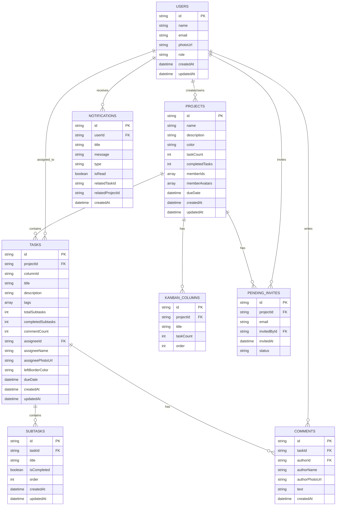

# Komo App - NoSQL Database Schema

## Entity Relationship Diagram

## Collections Overview

| Collection | Description |
|------------|-------------|
| **USERS** | App users with profile info and role |
| **PROJECTS** | Projects with embedded member references and progress tracking |
| **TASKS** | Tasks within projects, linked to kanban columns and assignees |
| **SUBTASKS** | Checklist items nested under tasks |
| **COMMENTS** | Discussion threads on tasks |
| **KANBAN_COLUMNS** | Column definitions (À faire, En cours, Terminé) |
| **NOTIFICATIONS** | User notifications (task assigned, comments, deadlines, etc.) |
| **PENDING_INVITES** | Project invitation tracking |

## NoSQL Design Notes

For a document database like **Firestore** or **MongoDB**, consider these embedding strategies:

- **Subtasks** → Can be embedded directly in the Task document as an array
- **Comments** → Could be embedded in Tasks if count is low, or kept as a subcollection for scalability
- **Kanban Columns** → Can be embedded in Project as they're typically 3-5 fixed columns
- **Tags** → Already stored as arrays within Tasks (denormalized)
- **Member info** → Denormalized `assigneeName` and `assigneePhotoUrl` in Tasks for read performance

## Notification Types

| Type | Description |
|------|-------------|
| `taskAssigned` | When a task is assigned to a user |
| `taskCompleted` | When a task is marked as done |
| `comment` | New comment on a task |
| `mention` | User mentioned in a comment |
| `deadline` | Task deadline approaching |
| `projectInvite` | Invited to join a project |
